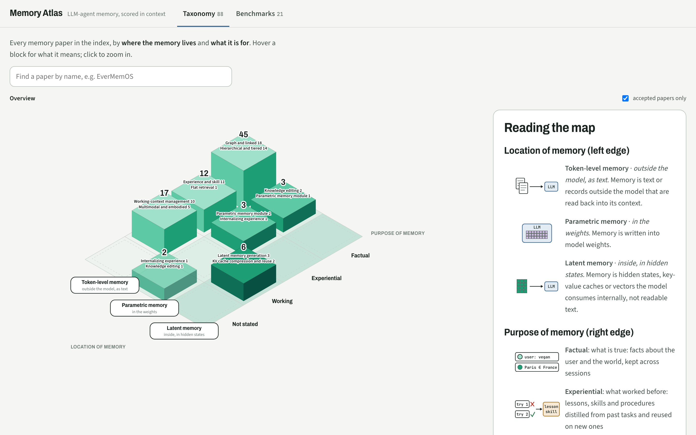
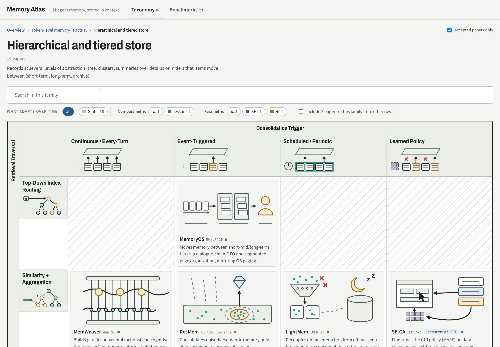

# Agent Memory Atlas

**[Open the atlas → hanaisreal.github.io/agent-memory-atlas](https://hanaisreal.github.io/agent-memory-atlas/)**

A map of LLM-agent memory research: **where each system keeps its memory, what the memory is for, how it is
built and read, and what its scores actually mean.** 672 papers are placed on one map; 93 of them have a full
record read from the paper *and* checked against the released code: construction and retrieval drawn as
figures, every main-table number with the setting it was measured under, ablations, and where the paper and
its code disagree.



- **Overview → zoom → details.** The isometric map puts every paper by *location of memory* (outside the
  model as text, in the weights, in hidden states) and *purpose* (factual, experiential, working). Click a
  block to see its families, then a family to see its papers laid out on two axes of its own.
- **Find any paper by name.** The search box says where it sits and lights up its block.
- **Accepted papers first.** Venues are checked against proceedings or the authors' own arXiv comment; turn
  the filter off to see preprints.
- **Paper vs code.** Most records note where the released code does something other than what the paper
  says (different top-k, a step that never runs, a threshold that differs), with the commit and line.



The same system routinely appears with very different scores in different papers. On LoCoMo (overall,
LLM-judge), the scores recorded here for Mem0 range from 43.3 to 66.9 across 11 settings, and EverMemOS
appears as 92.3, 93.05 and 94.48 depending on who reports it. None of those differences comes from the
memory system. They come from the answering model, the judge, the judge prompt, the benchmark version
and which questions were kept, which most papers report only partly. The atlas keeps every score with
its setting so you can see which numbers can be compared.

## What is in it

The site currently shows **Taxonomy** and **Benchmarks**; the other views are hidden while they are
reviewed (list them in `VIEWS` at the top of `site/app.js` to show them).

| View | What it shows |
|---|---|
| **Benchmarks** | Benchmark papers on their own, grouped by family, same zoom and paper detail as the Taxonomy |
| **Taxonomy** | The atlas's own families (`data/taxonomy.json`): every memory paper of the index sits in one family, its main contribution, on a grid of where memory lives (token-level, parametric, latent) by what it is for (factual, experiential, working) or by how it learns (does not learn, experience, SFT, RL, trained with the model). Each entry says what it stores and how, written from its abstract. Surveys come first; benchmarks, security and products below. Papers not about memory and theory papers are kept in the data but hidden |
| **Systems** | Annotated systems described stage by stage (construction, organization, management, retrieval, use) plus who decides at each stage, filterable by controlled tags; column groups can be hidden |
| **Pipeline** | The same systems by pipeline stage: ingestion, construction, organization, update, retrieval, answer, learning |
| **Results** | Every score, one column per evaluation setting; spread of each system across settings; head-to-head comparison restricted to shared settings |
| **Papers** | 671 entries merged from four community lists (joined by arXiv id, or by title when a list gives no arXiv link), keeping each list's own axis as a filter |
| **Method** | Comparability rules and the known traps of each benchmark |

Paper index sources (pinned in `scripts/import_lists.py`):
[Shichun-Liu/Agent-Memory-Paper-List](https://github.com/Shichun-Liu/Agent-Memory-Paper-List) (function × form),
[TeleAI-UAGI/Awesome-Agent-Memory](https://github.com/TeleAI-UAGI/Awesome-Agent-Memory) (substrate, products, benchmarks),
[DEEP-PolyU/Awesome-GraphMemory](https://github.com/DEEP-PolyU/Awesome-GraphMemory) (pipeline stage, graph memory),
[yyyujintang/Awesome-Agent-Memory-Papers](https://github.com/yyyujintang/Awesome-Agent-Memory-Papers) (storage / learning / memory-type tags).

## Layout

```
data/systems/<id>.json        one annotated system (paper with venue and track, grouped design fields,
                              single-valued map placement in `classify`, tags, pipeline stages)
data/results/<reporter>.json  every score from one paper, with its settings and table reference
data/benchmarks.json          benchmark registry with versions and pitfalls
data/extra_systems.json       baselines that appear in results but are not annotated yet
data/papers.json              generated paper index (do not edit by hand)
data/taxonomy.json            the atlas's families, functions and learning types, with definitions
data/paper_families.json      each paper's family, one-line mechanism and learning type
                              (from scripts/fetch_abstracts.py + classification; "checked": true keeps hand edits)
data/table_images.json        which table images exist, and their page numbers (generated)
schema/SCHEMA.md              field definitions, controlled vocabularies, comparability rule
docs/DESIGN.md                why the screens look as they do: text levels, bold headings, indentation,
                              with the reading studies each rule comes from
scripts/import_lists.py       regenerate data/papers.json from the upstream lists
scripts/build.py              validate data/ and write site/atlas.json
scripts/capture_tables.py     crop the cited tables out of paper PDFs into site/tables/
site/                         static site (index.html, app.js, style.css, atlas.json)
site/tables/, site/figures/   table and system images, captured by hand or by script
```

## Run it

```bash
python3 scripts/build.py                  # validate + write site/atlas.json
python3 -m http.server 8000 -d site       # open http://localhost:8000
python3 scripts/import_lists.py           # refresh the paper index (needs network)
```

The site is plain HTML/JS with no build step, so `site/` can be served from GitHub Pages as is.

## Checking a number against its source

Every table reference in the site ("Table 2 ↗") links to the paper, opening the arXiv PDF at the cited
page when it is known. Hovering or focusing the link shows an image of the table as printed in the
paper, so any score can be checked without leaving the page.

### Adding images by hand

Drop screenshots into these folders; `scripts/build.py` picks them up by file name, no other edits needed.

| What | Path | Example |
|---|---|---|
| A results table a paper reports | `site/tables/<reporter-id>/table-<n>.png` | `site/tables/mem0-2504.19413/table-1.png` |
| A system's architecture figure | `site/figures/<system-id>.png` | `site/figures/mem0.png` |

`<reporter-id>` is the results file name without `.json` (see `data/results/`); `<n>` is the table number
used in the rows' `location`; `<system-id>` is the system file name in `data/systems/`. PNG, JPG, WebP
and SVG all work. Then run `python3 scripts/build.py` and commit the images with `site/atlas.json`.
System figures show at the top of the system's panel and as a "figure ↗" link in the Systems table.

### Capturing tables automatically

`scripts/capture_tables.py` crops cited tables out of PDFs (not committed; file names must contain the
arXiv id). It follows each table's horizontal rules from its caption and falls back to the whole page
when it cannot find them, so check the crops before committing.

```bash
pip install pymupdf
python3 scripts/capture_tables.py --pdf-dir ~/papers
python3 scripts/build.py
```

## Adding a system or a paper's results

1. Read `schema/SCHEMA.md`.
2. Add `data/systems/<id>.json` and/or `data/results/<system-id>-<arxiv-id>.json`.
3. Record **every** row of the paper's results tables, baselines included, with the table reference in
   `location`. A setting the paper does not state is `null`, never a guess.
4. Run `python3 scripts/build.py --check`.
5. Leave `"verified": false` unless you checked every field against the paper yourself.

## Status

93 system records and about 15,000 result rows. Each record was written from the paper PDF and, where code was
released, the code at a pinned commit; numbers were checked against the paper's tables. They are still marked
`"verified": false` until a person has checked them line by line. Every row points to its table so it can be
checked. Accepted papers are being annotated first; preprints follow.

## License

Code (scripts, site): MIT, see `LICENSE`. Annotations and result records in `data/`: CC BY 4.0, see
`data/LICENSE`. Upstream lists keep their own licenses.
